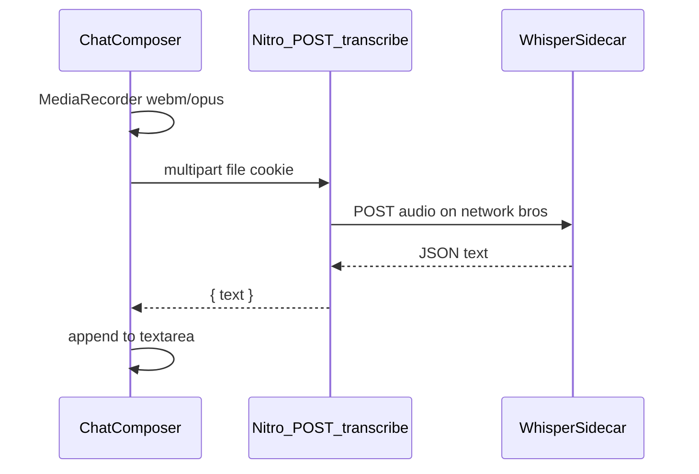

# Chat voice-to-text (Whisper sidecar)

## Can we just install Whisper and pipe audio?

**No as a Unix pipe. Yes as an HTTP pipe.**

Mic lives in the browser (`getUserMedia` + `MediaRecorder`). Bros app is Node/Nitro in Docker. Whisper weights + ffmpeg do not belong in the Nuxt image. There is no stdin from Chrome into `whisper` on the host.

Correct Bros shape (same as Ollama): **addon sidecar** on network `bros`. Browser sends a short audio blob to Nitro; Nitro forwards it to the sidecar; sidecar returns text; composer gets the text.

Do not use the browser Web Speech API (not Whisper, needs Google, Chrome-only). Do not call Groq/OpenAI `/audio/transcriptions` in v1 (local-only, matches “install Whisper”). Groq `whisper-large-v3` staying in the chat model list is out of scope.

## Sidecar pack

New shipped **addon** (not core — Ollama stays the only must-run):

- `[sidecars/whisper/sidecar.yml](sidecars/whisper/sidecar.yml)` — `id: whisper`, interface `type: api` (not `webui`; no Open/Pin), `service: whisper`, container port matching the image (likely 8000 or 9000), host publish **8090** (`BROS_WHISPER_PORT`). Never 3000/8080.
- `[sidecars/whisper/docker-compose.yml](sidecars/whisper/docker-compose.yml)` — same contract as OpenCode: `BROS_HOST_DATA_DIR:?unset` bind, `restart: unless-stopped`, external network `bros`.
- Bind `$BROS_HOST_DATA_DIR/whisper` for model cache (ggml / huggingface cache). First start downloads the model once.

**Image (pin a digest at implement time):** prefer a CPU image that already runs ffmpeg + HTTP STT so MediaRecorder `audio/webm;codecs=opus` does not need a second converter in Nitro.

1. First choice: OpenAI-compat `POST /v1/audio/transcriptions` (e.g. Speaches) so the proxy is one FormData POST.
2. Fallback: `onerahmet/openai-whisper-asr-webservice` `POST /asr`.

Default model: `**base**` (multilingual, ~150MB). Short chat clips are fine on CPU. No GPU overlay in v1 (Ollama GPU stays Ollama-only). Follow-up: `docker-compose.gpu.yml` like `[sidecars/ollama/docker-compose.gpu.yml](sidecars/ollama/docker-compose.gpu.yml)`.

Autostart: same as other addons (on unless `BROS_SIDECAR_WHISPER=0` or `BROS_SIDECARS_DISABLE`). Disable hides nothing on Sidecars; it only skips autostart. If the pack is down when the user hits mic, transcribe handler tries `startSidecar('whisper')` then forwards (first use can be slow: image + model).

Nitro URL helper (copy `[sidecarOllamaUrl](src/server/utils/ollamaHost.ts)`): Docker DNS `http://whisper:<containerPort>` inside Compose; `http://127.0.0.1:8090` for `pnpm app:dev`.

## API

`POST /api/chat/transcribe` (session cookie, same gate as other `/api/chat/*`).

- Body: multipart `file` (webm/ogg/wav/mp4). Cap ~15MB / ~60s. Use h3 `readMultipartFormData` (already in Nitro). Raise Nitro body limit on this route if the default is too small.
- Proxy with `ofetch` to the sidecar. Return `{ text }`. Empty speech: `{ text: "" }` (no 500).
- Errors: 400 bad/missing file, 503 sidecar unreachable after start attempt, 413 too large.

No new auth. No Bearer. Add path + schema to `[docs/api.md](docs/api.md)` and `[docs/api/openapi.yaml](docs/api/openapi.yaml)`.

## Chat UI

`[src/app/pages/chat/[[id]].vue](src/app/pages/chat/[[id]].vue)` composer: round `UButton` **left of Send/Stop**, `i-lucide-mic`, `aria-label="Voice to text"`.

- Click starts record; click again stops and uploads (toggle, not hold-to-talk — mobile).
- Recording: accent pulse, label “Stop recording”.
- Transcribing: disable mic, keep typed text.
- Success: append trimmed text to `input` (space if needed). **Do not auto-send.**
- `getUserMedia` deny / insecure context (HTTP non-localhost): `useToast`, no throw.
- Recording allowed while assistant is streaming (next prompt).
- Extract `useChatVoice` only if the page script gets messy; otherwise keep in the page.

DESIGN: mic is a sibling of `.bros-chat__send`, same pill radius.

## Tests

- Unit: sidecar URL (docker vs host), transcribe parse (`text` vs ASR `transcription` vs raw string), 413/503.
- Compose contract: add `sidecars/whisper/docker-compose.yml` to the `BROS_HOST_DATA_DIR` + external `bros` loop in `[test/unit/sidecar-project.test.ts](test/unit/sidecar-project.test.ts)`.
- Nuxt: `[test/nuxt/chat-page.test.ts](test/nuxt/chat-page.test.ts)` asserts mic button exists on empty `/chat` and docked `/chat/:id`. Mock `MediaRecorder` / `getUserMedia` if a click test is cheap; otherwise presence + aria is enough.
- Docs nav: new page must be in `[docsNav.ts](src/layers/docs/app/utils/docsNav.ts)` or `docs-nav.test.ts` fails.

## Docs / contract (keep in sync)

- SPEC: addon list includes Whisper; Chat composer has mic; STT is sidecar not a Chat provider.
- STACK: publish **8090**; data dir `$BROS_HOME/data/whisper`.
- DESIGN: mic next to send.
- PLAN: check off “voice to text for chat using whisper”.
- `[docs/chat.md](docs/chat.md)`, `[docs/sidecars.md](docs/sidecars.md)`, new `[docs/sidecars/whisper.md](docs/sidecars/whisper.md)`, `[docs/environment.md](docs/environment.md)`, `[docs/app.md](docs/app.md)` if it lists addon packs.
- `[ensureDataLayout](src/server/utils/config.ts)` can mkdir `whisper` or let Compose create the bind.

## Verify

Browser: `/chat` mic → allow permission → speak → text in composer → Send still works. Repeat on `/chat/:id`. HTTP localhost (secure) and note tunnel needs HTTPS for `getUserMedia`. If no browser tools: curl multipart against transcribe + Nuxt tests; say what was not clicked.

## Non-goals (v1)

Live partial captions, TTS, auto-send, GPU Whisper, cloud STT fallback, installing `openai-whisper` in the app container.